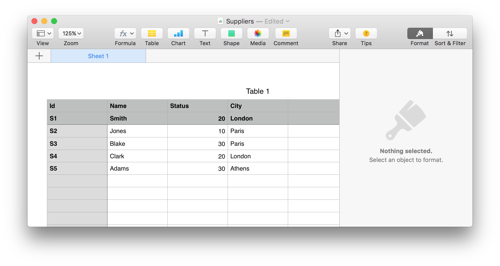

### Why did I even do this?

So... an issue came up at work the other day requiring me and my pair to upload and query against data from an Excel spreadsheet as well and join it to data from various database tables.
I'd come across articles in the past about type providers in F# and I wondered:
is there a way to query _directly_ against not only a table but a spreadsheet too?
And be able to do things like joins between disparate datasources?

Well... it turns out you can... fairly easily with F# and type providers.

### Selecting an example schema

I used the well-known Suppliers/Parts schema used in many of C.J. Date's textbooks; you can read more it here: http://c2.com/cgi/wiki?SupplierPartsDatabase I then decided to experiment putting one set of data in an Excel file, another in code as an array of F# records, and the third in a proper database table.

### Create an Excel spreadsheet and reference it as a datasource

I created a simple spreadsheet using Numbers on OS X, populated it with the Suppliers data, and saved it as a .xls file. (I had first saved it as a .xlsx file and tried using it, but I kept getting an error when trying to reference it from the type provider. I don't know if the problem is with the type provider or that Numbers isn't quite saving the file properly.)



So... the next thing I needed to do was look for a type provider for Excel... and I came across [ExcelProvider](http://fsprojects.github.io/ExcelProvider/), which is ok to use on the Mono platform. (There is another package from Microsoft, which is nicely explained [here](https://blogs.msdn.microsoft.com/jackhu/2011/04/19/fsharp-excel-reading-and-writing-from-and-to-excel/), but you need to use Windows.)

To install it, I ran the following:

```
nuget install excelprovider
```

(When I did this, it installed the package to my home directory and not the project directory I was already in. I'm more used to dependency management tools for languages like Clojure, Haskell, and Ruby where you can install libraries for a particular project or globally and easily use them in a REPL. I'm not absolutely sure this is the proper way to manage libraries for F# projects nor if installing them globally is even recommended.)

Nonetheless, here I reference the dependency, open the package, declare a type provider for the file, and then instantiate a class so I can actually read from it.

```
#r "/path/to/install/folder/lib/ExcelProvider.dll"

open FSharp.ExcelProvider

type SuppliersExcelFileType = ExcelFile<"./data/Suppliers.xls">

let file = new SuppliersExcelFileType()

let suppliers = file.Data
```

(As far as I know, you must use absolute paths to DLLs in order to use them in a REPL. If someone knows a better way, I'd love to know.)

Next, I can actually write queries against the "loaded" file:

```
query { for s in suppliers do
        select (s.Id, s.City) }
```


### Create an array of records to use as a second datasource

Next, I'm going to declare a record type correspondent with the row type for the Parts table and initialize an array with data:

```
type part = { Id : string;
              Name : string;
              Color : string;
              Weight : float;
              City : string };;

let parts =
  [ { Id = "P1"; Name = "Nut"; Color = "Red"; Weight = 12.0; City = "London" }
    { Id = "P2"; Name = "Bolt"; Color = "Green"; Weight = 17.0; City = "Paris" }
    { Id = "P3"; Name = "Screw"; Color = "Blue"; Weight = 17.0; City = "Oslo" }
    { Id = "P4"; Name = "Screw"; Color = "Red"; Weight = 14.0; City = "London" }
    { Id = "P5"; Name = "Cam"; Color = "Blue"; Weight = 12.0; City = "Paris" }
    { Id = "P6"; Name = "Cog"; Color = "Red"; Weight = 19.0; City = "London" } ]
```

Now I can write queries against it too:

```
query { for p in parts do
        where (p.Color = "Red")
        select (p.Id, p.Name) }
```


### Create a Postgres table as a third datasource

After a short time spelunking, I found a type provider that supports multiple database implementations [here](http://fsprojects.github.io/SQLProvider/index.html).

I also needed to find a database connectivity driver for Postgres, and found `npgsql` [here](http://www.npgsql.org/).

I installed them both:

```
nuget install sqlprovider
nuget install npgsql
```

OK... so the next thing to do was create a table and load it with data, this time those for the SupplierParts relation:

```
create table supplier_parts
       (supplier_id   varchar,
        part_id       varchar,
        quantity      integer);

insert into supplier_parts
values ('S1', 'P1', 300),
       ('S1', 'P2', 200),
       ('S1', 'P3', 400),
       ('S1', 'P4', 200),
       ('S1', 'P5', 100),
       ('S1', 'P6', 100),
       ('S2', 'P1', 200),
       ('S2', 'P2', 300),
       ('S3', 'P2', 200),
       ('S4', 'P2', 200),
       ('S4', 'P4', 300),
       ('S4', 'P5', 400);
```

Next, I needed to do something similar to what I did above for the Excel file, namely reference the library and create the type provider.

```
#r "/path/to/install/folder/lib/FSharp.Data.SQLProvider.dll"

open FSharp.Data.Sql

let [<Literal>] connString = "Server=localhost;Database=your_db;User Id=your_user_id;Password=your_password"

type sql = SqlDataProvider<Common.DatabaseProviderTypes.POSTGRESQL,
                           connString,
                           ResolutionPath = @"/path/to/install/folder/lib/net451">

let ctx = sql.GetDataContext()

let supplierParts = ctx.Public.SupplierParts
```

Let's see if this query works first:

```
query { for sp in supplierParts do
        select (sp.SupplierId, sp.PartId, sp.Quantity) }
```


So... I have an Excel file an array and a database table... and I want to know, say... hmmm... give me the suppliers who have parts such that the supplier city is different from the part city and the quantity available through the supplier is greater than or equal to 300. Sound impossible? Here's the query:

```
query { for s in suppliers do
        join sp in supplierParts on (s.Id = sp.SupplierId)
        join p in parts on (sp.PartId = p.Id)
        where (s.City <> p.City && sp.Quantity >= 300)
        select (s.Id, s.Name, p.Id, p.Name, sp.Quantity) };;
```

... and:


### Summary

I was amazed at how easy the querying part of this experiment was. Some of the harder things were:

* finding libraries that worked on the Mono platform and had no dependencies on Windows binaries
* figuring out where NuGet installed libraries and then how to reference them from within the REPL

There are a few things that I do wonder about:

* How does this sort of thing scale? How large can the sets of data be for these queries to be performant and/or not consume too much memory?
* Is this otherwise something to seriously consider doing in a business context? I could definitely imagine it being useful to somehow enable users to be able to select from arbitrary source types (and do so safely).
